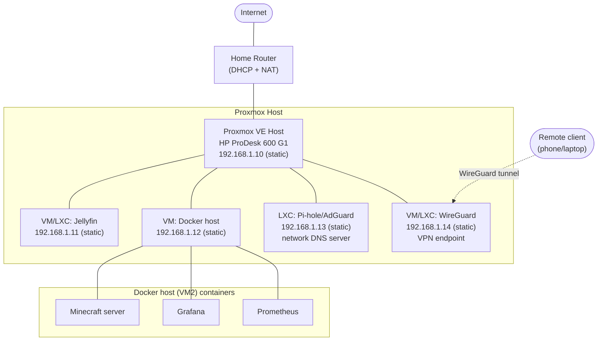

# Network Diagram

**Status: proposed, not confirmed.** No current subnet/router/DHCP details are documented
anywhere in this repo yet (see [`../docs/networking.md`](../docs/networking.md)). This diagram
is a *starting-point recommendation* to compare against the actual home network setup and adjust
— it is not a record of what currently exists.

## Proposed topology

## Assumptions baked into this proposal

- Flat network (no VLAN segmentation) — see the segmentation discussion in `networking.md` for
  why this is a reasonable starting default rather than a hard recommendation.
- Subnet assumed as `192.168.1.0/24` — replace with whatever the actual router's subnet is.
- Static IP reservations for anything acting as a server (Jellyfin, the Docker host, Pi-hole/
  AdGuard, the WireGuard endpoint) — set these via DHCP reservations on the router or static
  config on each VM/LXC, not left on dynamic DHCP, since Pi-hole in particular needs a fixed
  address to be usable as the network's DNS server.
- Docker workloads (Minecraft, Grafana, Prometheus) shown as containers inside a single "Docker
  host" VM, per the recommendation in `../docs/services.md` (Docker in a VM, not nested in LXC).

## To confirm/replace once known

- [ ] Actual router model and subnet
- [ ] Actual Proxmox host IP
- [ ] Whether reservations are done via router DHCP or static config per guest
- [ ] Any VLAN/segmentation decision, if it changes from the flat-network default above
